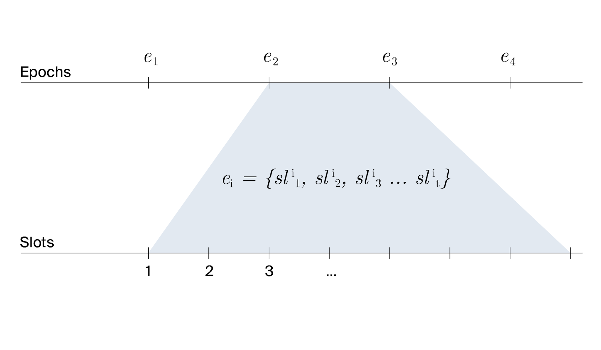
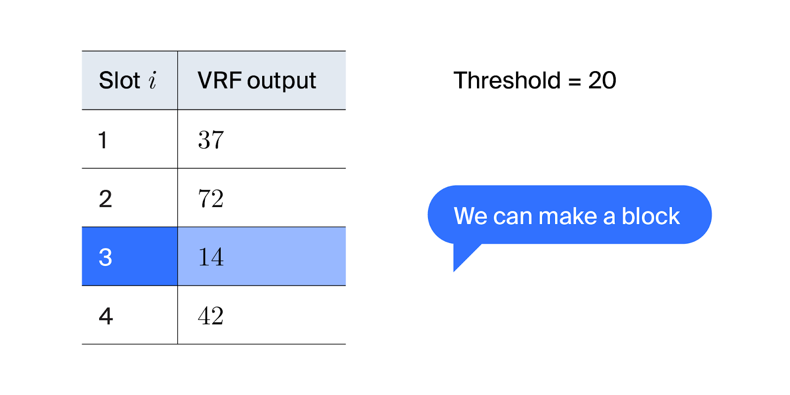
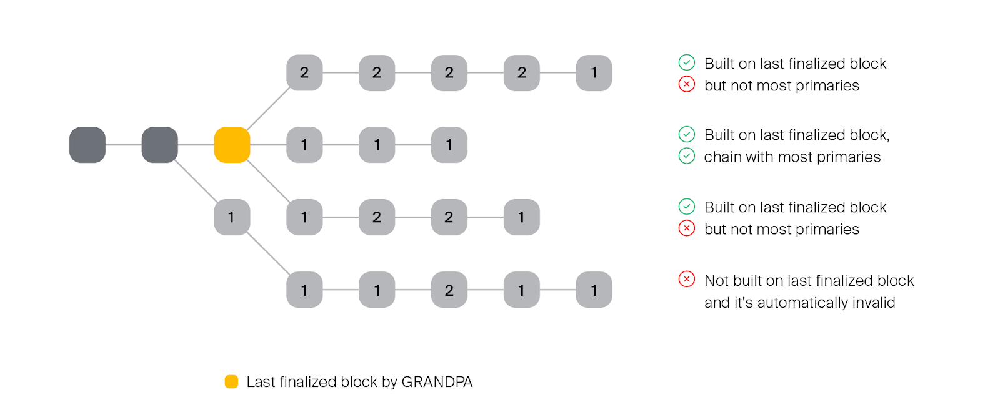
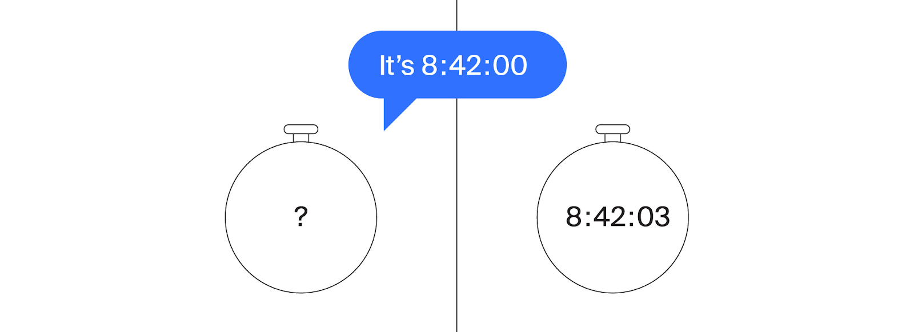
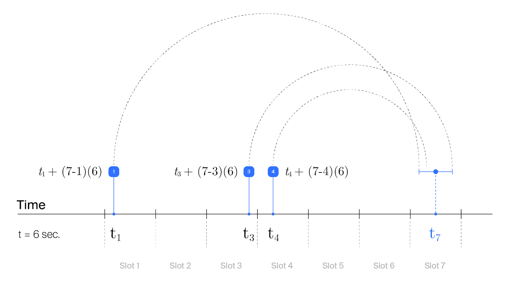

# 波卡共识 Part 3: BABE

> 原文链接：<https://polkadot.network/blog/polkadot-consensus-part-3-babe/>
>
> 翻译：[Akagi201](https://github.com/Akagi201)

区块链扩展的盲目分配（Blind Assignment for Blockchain Extension）是一个区块生产引擎，它的灵感来自于 Ouroboros Praos，另一个股权证明协议。它可以单独使用，因为它提供了概率最终性，或者它可以与 GRANDPA 这样的最终性程序结合使用。

BABE 是一种基于 slot 的算法。它将时间分成几个 epoch，每个 epoch 又被分成几个 slot。在 Polkadot 中，每个槽的长度为 6 秒，即我们的目标块时间。BABE 会选择一个（或几个）作者，在每个槽中编写一个块。

> BABE 里的时间分解成 epoch，每个 epoch 由 slot 集合组成。

将作者分配到这些 slot 的一种方法是简单地轮询。然而，在轮询模式中，对手总是知道谁是下一个作者，并可以利用这一信息来协助攻击。理想情况下，没有人知道谁是槽的作者，直到他或她证明了这一点。

每个槽可以有一个 Primary 和 Secondary 作者（或 "slot leader"）。Primary slot leaders 是随机分配的。然而，由于该函数是随机的，有时会出现没有 leader 的槽。为了确保块状时间的一致性，BABE 使用一个轮训系统来分配 secondary slot leaders。

## Primary Slot Leaders

Primary leadership 是根据可验证的随机函数（VRF）的评估来授予的。围绕区块链中的随机数有很多炒作。长话短说，很多应用都依赖于随机数的生成，但当所有的链上操作都必须是确定的和可验证的时候，要找到大家都同意的随机性（并且不被操纵，使生成者受益）是很难的。

VRFs 生成一个伪随机数，并证明它是正确生成的。它们接受一些参数，包括一个私钥，作为输入。我们的 VRF 需要一个 epoch 随机种子（由所有节点事先商定）、一个槽号和作者的私钥。因为没有两个节点有相同的私钥，所以每个节点可以为每个槽产生一个独特的伪随机值。

每个作者在一个 epoch 中为每个槽评估其 VRF。对于输出低于某个商定的阈值的每个槽，验证者有权在该槽中生成一个块。由于随机的槽位分配过程，有可能出现没有主的槽位，也有可能出现有多个主的槽位。我们将在后面讨论如何处理这个问题。

> BABE 中的 VRF 将一个 epoch 随机数、槽号和验证者私钥作为输入，并为一个 epoch 中的每个槽输出一个值。当一个区块作者的输出低于网络的阈值时，它就会产生一个区块作为该槽的主要区块领导者。

## Secondary Slot Leaders

为了处理空槽，BABE 使用了一个回退的轮训的方法。每个 slot 都有一个 secondary leader。如果在 slot 开始时没有人声称他们是 primary，那么 secondary 就会生成一个区块。这种回退将确保每个槽都有一个区块的作者，并有助于保证一个一致的区块时间。

## 把 BABE 和 GRANDPA 结合起来

到目前为止，我们有 GRANDPA 最终性链，BABE 创造新的区块。BABE 的一些链可能有分叉，因为一个槽可以有多个 leader。

选择最佳扩展链的第一条规则很简单。BABE 必须建立在已经由 GRANDPA 敲定的链上。这是使用 GRANDPA 的要求之一。

使用 GRANDPA 的第二个更微妙的要求是，区块生产算法必须有选择 "最佳" 链的方法。这一特性导致 BABE 具有概率最终性（因此，你可以在没有 GRANDPA 的情况下使用它）。

BABE 中的最佳链仅仅是拥有最多 primaries 区块的链。

> 一个例子关于 BABA 分叉选择规则对于选择一个最佳链

分叉在 BABE 中很常见。正如 GRANPA 文章中所讨论的，区块生产是 O(n)，意味着作者只需将其区块广播给每个人，但不需要每个人向每个人发送消息（像 GRANDPA）。所以，并不是每个人都会对非最终化的链有相同的看法（图片中的黄色块）。

这个系统让我们以高效的方式生产区块，并让 GRANDPA 最终确定其中的一组区块。

## 等等，谁的时钟？

我们是根据时间来分配 slot 的，但我们没有一个单一的时间。每台计算机都有自己的时钟。我们不能使用集中的时间服务（称为 NTP 服务器），因为那是一个单一的攻击点。攻击者可以攻击 NTP 服务器，要么切断它，要么控制它，以达到更肆无忌惮的行为，如向不同节点发送不同的时间。

如果你有兴趣，可以考虑这种情况：

我收到你的信息说 "现在是 `8:42:00`"。我的时钟显示现在是 `8:42:03`。有三件事是可能的。

1. 我们的时钟是同步的，只是网络花了 3 秒钟来传递你的信息。

2. 它实际上花了 1 秒钟来传递你的信息。我们的时钟不同步了 2 秒。

3. 你在骗我，你的时钟不是这么说的。

> 如果我相信你是在诚实地告诉我你的时钟是怎么说的，那么我就知道我们不同步了，我必须把我的时钟往前调。我仍然不知道它通过网络传递的时间，所以我不知道我们有多少不同步的地方。

BABE 使用相对时间将槽位号与单个计算机的时钟对齐。当一个节点收到一个块时，它检查接收时间和与该块相关的槽号。然后，它将槽位号加到每个块的时间上，以预测未来的 slot，并使用其数据中的中位数。记住，验证器知道他们将提前授权的槽位号，所以他们可以根据这个来检查进入的块。

> BABE 中的区块作者使用区块的接收时间来创建网络的时间视图。他们根据 slot 时间，将接收时间投射到未来，以确定他们应该何时编写和提出一个区块。

到目前为止，我们已经讨论了链是如何产生的（BABE）和如何最终确定（GRANDPA）。我们要解决的下一个问题是，我们如何让人们以正确的方式运行这些协议？本系列的[最后一部分](https://polkadot.network/blog/polkadot-consensus-part-4-security/)将讨论运行时如何为运行 BABE 和 GRANDPA 提供激励以及对错误的惩罚。
