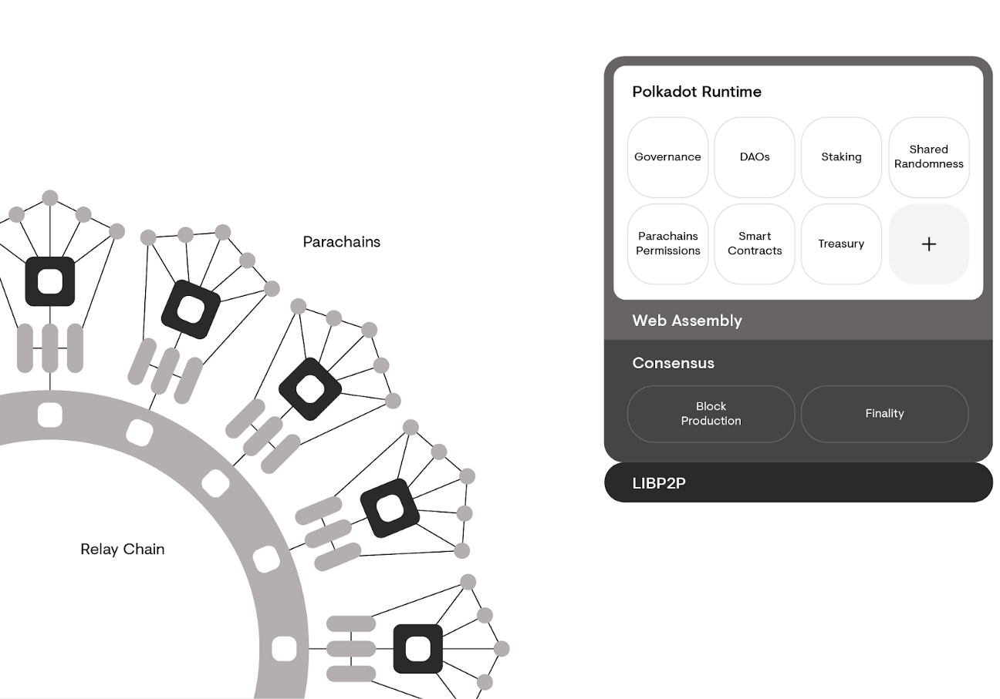
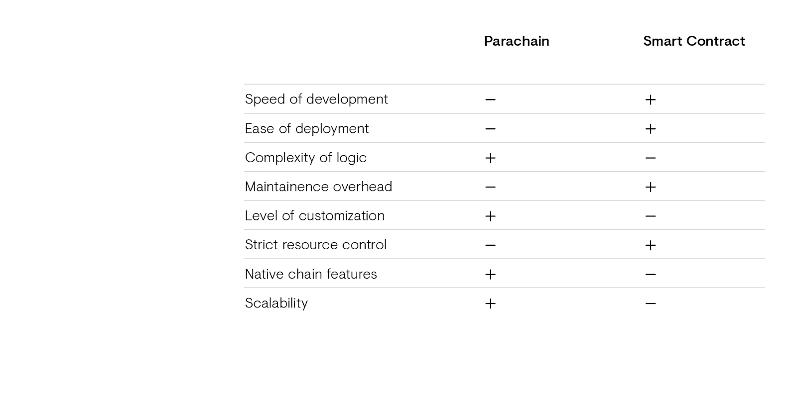

# Polkadot 构建者入门指南

> 原文链接：<https://wiki.polkadot.network/docs/build-build-with-polkadot>
>
> 翻译：[Akagi201](https://github.com/Akagi201)

Polkadot 是一个区块链协议，有两个目标：在所有连接的 parachains 之间提供共享安全 (`shared security`)，并允许所有连接的链通过使用 [XCM](https://wiki.polkadot.network/docs/learn-crosschain) 进行交互。随着像 Parity Substrate 和 Cumulus 这样的 [PDK](https://wiki.polkadot.network/docs/build-pdk#parachain-development-kit-pdk) 的出现，开发和启动一条新链的时间已经大大下降。以前启动一条新链需要几年时间，现在可能只需要几周甚至几天。

本指南将引导你了解你现在可以采取的步骤，开始用 Polkadot 建立你的愿景。它将解释 parachain 和智能合约之间的区别（以及为什么一个可能比另一个更适合你的应用）。

## 波卡生态网络

* Mainnet: `Polkadot`
* Canary network: `Kusama`

  * [Kusama](https://kusama.network/) 是一个有价值的 Canary 网络，在 Polkadot 之前获得功能。`Expect Chaos`

* 官方测试网：
  
  * `Westend` - 功能等同于目前的 Polkadot 主网，可能不时进行下一代功能的测试，最终会迁移到 Polkadot 上。永久测试网（不会被重置到创世块）。
  * `Canvas` - 基于 Wasm 的智能合约的测试网，主要用于 `ink!` 开发。
  * `Rococo` - 平行链和 XCM 测试网。偶尔会重置（用一个新的创世块重新开始）。

Polkadot 主网自 2020 年 5 月开始运行，有从 Rust 到 JavaScript 等各种编程语言的实现。目前，领先的实现是用 Rust 构建的，并使用 Substrate 框架构建。

工具正在迅速发展，来与网络进行交互；有许多方法可以开始！但在你一头扎进网络之前，你必须先了解它。

但在你一头扎进代码之前，你应该考虑你想做什么样的去中心化应用，并了解那些想在 Polkadot 上构建的开发者可以使用的不同范式。

## 构建一个 parachain，一个 parathread，或者一个智能合约之间有什么区别？

Polkadot 为你提供了几种方法来部署你的应用程序：作为现有 parachain 上的智能合约，作为你自己的 parachain，或作为 parathread。在使用这些方式时，有一些权衡，阅读本节将帮助你了解这些权衡。

### Parachains & Parathreads

Parachains 是包含自己的运行时逻辑的平行链，并受益于 Polkadot 中继链提供的共享安全和跨链信息传递。Parachains 允许高度的灵活性和定制化，但需要更多的努力来创建和维护。

Parathreads 和 parachains 一样，使开发者能够对其应用的逻辑进行较低层次的控制。两者之间的主要区别在于经济性，因为 parathreads 的安全成本会比 parachain 低很多。parathreads 的成本较低是由于 parathreads 只会在需要的时候产生一个区块，而不像 parachains 那样，在中继链的每一个区块都确保了一个槽来产生一个区块。当建立一个 parathread 时，你将使用相同的工具（如 PDK），你会得到建立 parachain 的所有好处，而没有成本的缺点。

parachains 给予创造者更多的空间，从头开始建立货币系统和其他方面的链。它们将允许更简洁和有效地执行复杂的逻辑，而不是智能合约平台所能提供的。Parachains 还提供了更灵活的治理形式，并能以比目前的 hard-forks 过程更少争议的方式进行完全升级。

你可以在 parachain 或 parathread 上拥有一些功能的例子。

* 自定义手续费结构（例如，为交易支付统一费率或按字节付费）。
* 为原生代币和本地经济定制货币政策。
* 通过你的状态转移函数来资助国库。
* 一个治理机制，可以管理一个 DAO，负责分配你的链上国库。

Parachains 为构建复杂的运行时逻辑提供了可能性，而用智能合约执行这些逻辑的成本太高。然而，与智能合约不同的是，parachains 完全缺乏一个强制性的 gas 计量系统，并有可能受到导致无限循环的错误的影响（这在智能合约中是通过设计来防止的）。这个漏洞被 Substrate 中实现的权重系统所缓解 -- 尽管它给 parachain 的开发者带来了更多的负担，以正确执行 benchmarks。

你也可以使用 parachain、parathread 和智能合约的组合。如果你有某些需要循环的逻辑，而它又不能被删除，那么就用原生的 parachain 运行时来处理所有复杂的逻辑，用智能合约来调用迭代。如果你需要来自 Oracle 的链外数据，你可能想使用 parathread 作为 Oracle feed，每 24 小时才触发一次（如果数据对 Polkadot 生态系统中的其他玩家也有用，这就最有意义了）。

很可能你已经意识到你的应用程序更适合成为其中之一（或两者的混合体），但如果你需要快速回顾以消化这些信息，你可以使用这个比较图作为一个小抄。

> #### 注意：上图没有包含 Parathreads
>
> 正如我们之前提到的，parachains 的所有好处也同样适用于 parathreads。然而，parathreads 在部署和维护方面更便宜。因此，如果它们在上表中有一列，它看起来就像 parachain 的那一列，但 "易于部署"和 "维护开销"改为 +。

### 智能合约

智能合约只是一些存在于链上某一地址的代码，可被外部行为者调用。关键的部分是，在任何人开始执行之前，你实际上必须把代码放在链上。

在链上部署你的智能合约，对于你将使用的任何一个特定的 parachain 来说，都会略有不同，但一般来说，你将发送一个特殊的交易，在账本上创建智能合约。你可能需要为初始化逻辑和你的合约所消耗的任何存储支付相关费用。

在 Polkadot 上，会有作为智能合约平台的 parachains。智能合约是只存在于单一链上的可执行程序，其复杂性有限。因为它们存在于单一的链上，所以它们可以与同一链上的其他智能合约有流畅的互操作性。然而，它们将始终受到其运行的链固有特性的制约和限制。

如果需要对你的应用程序的设计和功能有大量的控制，那么 parachain 是一个更好的选择。请记住，智能合约可以在以后变成成熟的 parachain 之前作为一个测试场地。智能合约平台通常会有方便的工具，如 IDE，以促进快速迭代。在投入工作建立 parachain 之前，可以创建一个智能合约 MVP 来衡量用户的兴趣。

每个平台都会有不同的方式来支付和维护你的智能合约的状态。你可能看到的为你的智能合约付费的不同模式包括：

* 与部署每个交易相关的交易费。
* 一种订阅模式，你为平台的使用定期向一些链实体付费。
* 访问代币模式，你需要持有一定数量的本地代币才能使用平台（EOS 也有类似的东西）。存储租金。
* 免费试用或开发者推广。
* 大多数智能合约平台使用某种形式的 gas 来限制用户可以执行的操作数量。用户需要预先支付 gas 的费用，不用的部分会被退还。

你将需要考虑你的智能合约的存储和复杂性，以确保 gas 的使用保持在合理范围内。无论你使用哪种智能合约平台，存储都可能是昂贵的，所以有必要尽可能多地将数据保存在链外。你可以考虑使用[去中心化存储](https://wiki.polkadot.network/docs/build-storage)页面上列出的选项来保存数据，只提交链上的内容地址。

### 构建 parachain 或 parathread

请参阅 [parachain 开发指南](https://wiki.polkadot.network/docs/build-pdk)，了解如何开始建立一个 parachain 或 parathread。

### 构建一个智能合约

请参阅[智能合约指南](https://wiki.polkadot.network/docs/build-smart-contracts)，了解如何开始构建智能合约。
