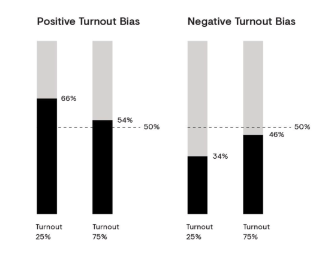

<!-- markdownlint-disable MD041 MD010 MD033 -->
# Polkadot 治理

> 原文链接：<https://wiki.polkadot.network/docs/learn-governance>
>
> 翻译：[Akagi201](https://github.com/Akagi201)

Polkadot 使用一个复杂的治理机制，使其能够在其集合的利益相关者的最终要求下优雅地超时发展。其既定目标是确保大多数利益相关者能够始终控制网络。

> ## 即将到来的治理改动
>
> 根据最近修改 Polkadot 治理的努力，本指南中的内容可能会有变化。更多细节请见此 [PR 请求](https://github.com/paritytech/substrate/pull/10195)。

为了做到这一点，该网络汇集了各种新颖的机制，包括一个存储在链上并由平台中立的中间语言（即 WebAssembly）定义的无定形状态转换函数，以及若干链上投票机制，如具有自适应超级多数门槛的全民投票和批量批准投票。

对协议的所有修改都必须由利益相关者加权的公投来同意。

## 机制

为了对网络进行任何改变，我们的想法是将活跃的代币持有者和议会一起组成一个网络升级的决定。无论该提案是由公众（代币持有者）还是议会提出的，最后都必须通过公投，让所有持有者按股权加权，做出决定。

为了更好地了解议会是如何形成的，请阅读[本节](https://wiki.polkadot.network/docs/learn-governance#council)。

## 公投 (Referenda)

公投是简单的、包容的、基于质押的投票方案。每个公投都有一个与之相关的具体提案，采取运行时中的特权函数调用的形式（包括最强大的调用：`set_code`，它可以修改运行时的整个代码，实现否则需要 "硬分叉" 的目的）。

公投是离散的事件，有一个固定的投票时间，然后进行统计，如果投票通过，就进行函数调用。公投总是二进制的；你在投票中的唯一选择是 "赞成"、"反对" 或完全弃权。

公投可以通过以下几种方式之一启动。

* 公开提交的提案。
* 由议会提交的提案，无论是通过多数还是一致同意。
* 作为先前公投颁布的一部分而提交的提案。
* 由技术委员会提交并由议会批准的紧急提案。

所有公投都有一个与之相关的颁布延迟。这是公投结束和（假设提案被批准）改动被颁布之间的时间。

如果公投结束并进行了统计，则被视为出炉 (baked)。同样，假设该提案被批准，它将被安排颁布。如果全民投票正在等待结果，即正在进行投票，则被视为未出炉 (unbaked)。

对于公投的前两种启动方式，这是一个 28 天的固定时间。对于第三种方式，可以根据需要设置。紧急提案处理的是网络中需要 "快速处理" 的重大问题。这些将有一个较短的颁布时间。

### 提案一个公投

#### 公投

任何人都可以通过存入一定时期（区块数）的最低数量的代币来提议进行公投。如果有人同意该提案，他们可以存入相同数量的代币来支持该提案 -- 这一行为被称为认可。在下一个投票周期中，获得最高额度绑定支持的提案将被选为公投。

请注意，这可能与绝对的秒数不同；例如，三个账户各自绑定 20 个 DOT 将 "超过" 十个账户各自绑定一个 DOT

一旦提案被提交（即提交给投票），担保的代币将被释放。

在提案队列中最多可以有 100 个公共提案。

#### 议会公投

一致通过的议会 -- 当议会的所有成员都同意一项提案时，它可以被移到公投中。这种公投将有一个负的投票率偏差（也就是说，利益相关者的投票量越小，通过所需的金额就越小 -- 见下文 "适应性法定人数偏差"）。

大多数议会 -- 当仅有简单多数的议会成员达成协议时，公投也可以进行投票，但它将是多数票通过（51% 获胜）。

在任何时候都只能有一个活跃的公投，除非同时有一个紧急公投正在进行。

#### 投票时间表

每隔 28 天，如果其中一个队列中至少有一个提案，就会有一个新的公投进行表决。有一个队列是议会批准的提案，还有一个队列是公众提交的提案。待表决的公投在两个队列中的最高提案之间交替进行。

"顶级"的提案是由其背后的质押数量决定的。如果轮到公投的队列中没有提案（是空的），而另一个队列中有提案在等待，那么另一个队列中的顶级提案将成为公投。

多个公投不能在同一时期进行投票，紧急公投除外。紧急公投与普通公投（无论是公众提议还是议会提议）同时发生，是唯一能够同时对多个公投进行投票的情况。

#### 在一个公投上投票

为了投票，投票者通常必须将其代币至少锁定在公投结束后的颁布延迟期内。这是为了确保需要对结果进行一些最低限度的经济买入，并劝阻卖票。

完全不锁定投票是可能的，但考虑到你的股份，你的投票只值正常投票的一小部分。同时，由于时间锁定，只持有少量的代币并不意味着持有人不能影响公投结果。你可以在[自愿锁定](https://wiki.polkadot.network/docs/learn-governance#voluntary-locking)中了解更多这方面的信息。

> ##### 公投解释视频
>
> 要了解更多在公投上投票，请查看我们的[技术解释视频](https://www.youtube.com/watch?v=BkbhhlsezGA)

例子：

Peter：投 `No`, 10 DOT，锁定期 128 周 => 10 x 6 = 60 票

Logan: 投 `Yes`, 20 DOT，锁定期为 4 周 => 20 x 1 = 20 票

Kevin：投 `Yes`, 15 DOT，锁定期为 8 周 => 15 x 2 = 30 票

尽管 Logan 和 Kevin 的投票数加起来比 Peter 多，但他们两人的锁定期都比彼得短，导致他们的投票权算少。

#### 计数 (Tallying)

根据哪个实体提出的天和所有议会成员是否投了赞成票，有三种不同的情况。我们可以用下面的表格来参考。

| Entity                       	| Metric                                         	|
|------------------------------	|------------------------------------------------	|
| Public                       	| Positive Turnout Bias (Super-Majority Approve) 	|
| Council (Complete agreement) 	| Negative Turnout Bias (Super-Majority Against) 	|
| Council (Majority agreement) 	| Simple Majority                                	|

同时，我们需要以下信息，并应用下面列出的公式之一来计算投票结果。例如，让我们以公开提案为例，所以将应用 `Super-Majority Approve` 公式。没有严格的法定人数，但所需的绝大多数会随着投票率的降低而增加。

```sh
approve - 赞同票数量
against - 反对票数量
turnout - 投票代币总数(不包含 conviction)
electorate - 网络发行的代币总量
```

#### 绝大多数赞同 (Super-Majority Approve)

正面的投票率偏置 (positive turnout bias)，即在低投票率时，需要大量的绝大多数赞成票才能通过，但随着投票率增加到 100%，就会变成简单的多数通过，如下图。

$\frac{against}{\sqrt{turnout}} < \frac{approve}{\sqrt{electorate}}$

#### 绝大多数反对 (Super-Majority Against)

负面的投票率偏置 (negative turnout bias)，即在低投票率时，需要大量的绝大多数反对票来拒绝，但当投票率增加到 100% 时，就会变成简单的多数通过，如下图所示。

$\frac{against}{\sqrt{electorate}} < \frac{approve}{\sqrt{turnout}}$

#### 简单多数 (Simple Majority)

多数票通过，是简单的票数比较；如果赞成票多于反对票，那么提案就通过了，不管有多少利益相关者对提案投票。

${approve} > {against}$

想了解更多以上这些公式哪来的，请查阅 [democracy pallet](https://github.com/paritytech/substrate/blob/master/frame/democracy/src/vote_threshold.rs)

例子：

假设我们总共只有 1_500 个 DOT 代币，而且这是一个公共提案。

* John: 500 DOT
* Peter: 100 DOT
* Lilly: 150 DOT
* JJ: 150 DOT
* Ken: 600 DOT

John: 投 `Yes` 锁定 4 周 => 500 x 1 = 500 票

Peter: 投 `Yes` 锁定 4 周 => 100 x 1 = 100 票

JJ: 投 `No` 锁定 16 周 => 150 x 3 = 450 票

* approve = 600
* against = 450
* turnout = 750
* electorate = 1500

$\frac{450}{\sqrt{750}} < \frac{600}{\sqrt{1500}}$

${16.432} < {15.492}$

由于上述例子是公开公投，所以会用绝大多数通过来计算结果。当投票率较低时，绝大多数赞成需要更多的赞成票来通过公投，因此，根据上述结果，公投将被拒绝。此外，只有获胜选民的代币被锁定。如果公投失败方的选民认为结果会产生负面影响，他们的代币是可以转让的，所以他们不会被锁定在这个决定中。此外，获胜的提案只有在某个颁布期之后才会自主颁布。

#### 自愿锁定

Polkadot 利用了一个叫做自愿锁定的想法，允许代币持有人通过声明他们愿意锁定他们的代币多长时间来增加他们的投票权，因此，每个代币持有人的投票数将通过以下公式计算：

```sh
votes = tokens * conviction_multiplier
```

信念乘数每增加一倍的锁定期，就会增加一个投票乘数。

| Lock Periods 	| Vote Multiplier 	|
|--------------	|-----------------	|
| 0            	| 0.1             	|
| 1            	| 1               	|
| 2            	| 2               	|
| 4            	| 3               	|
| 8            	| 4               	|
| 16           	| 5               	|
| 32           	| 6               	|

锁定期的最大 "翻倍" 次数被设定为 6 次（因此总共有 32 个锁定期），而一个锁定期等于 28 天。只允许整数翻倍；比如说，你不能锁定 24 个时期，然后把你的信念增加 5.5。

当代币被锁定时，你仍然可以使用它进行投票和质押；你只被禁止将这些代币转移到另一个账户。

无论代币被锁定多长时间，投票仍然在同一时间（投票期结束时）被 "计算"。

#### 自适应法定人数偏置 (Adaptive Quorum Biasing)

Polkadot 引入了一个概念，即 "自适应法定人数偏置"，其功能是一会可以用来改变所需的有效绝大多数，以便在没有明确的多数投票权支持或反对的情况下，使提案更容易或更难通过。



让我们以上面的图片为例。

如果一个公开提交的公投只有 25% 的投票率，"赞成" 票的总数必须达到 66% 才能通过，因为我们采用了正面的投票率偏置。

相反，当投票率达到 75% 时，"赞成" 票数必须达到 54%，这意味着所需的绝大多数随着投票率的增加而减少。

当议会通过一致同意提出一项新提案时，公投将采用 "负面的投票率偏置" 进行表决。在这种情况下，投票率低的情况下更容易通过这个提案，需要超级多数来拒绝。随着更多的代币持有者参与投票，该偏置接近于普通的多数通过。

参照上面的图片，当公投只有 25% 的投票率时，"赞成" 票的统计必须达到 34% 才能通过。

简而言之，当投票率较低时，拒绝提案需要绝大多数，这意味着必须达到较低的 "赞成" 票门槛，但当投票率上升到 100% 时，它就变成了简单多数。

所有三种计票机制 -- 多数票通过、绝大多数票赞成、绝大多数票反对 -- 在 100% 的投票率下都相当于简单多数票通过制。

## 议会

为了代表被动的利益相关者，Polkadot 引入了 "议会" 的概念。议会是一个链上实体，由几个行动者组成，每个人都代表一个链上账户。在 Polkadot，议会目前由 13 名成员组成。

除了[控制国库](https://wiki.polkadot.network/docs/learn-treasury)外，议会主要被要求完成三项治理任务：提出合理的公投，取消没有争议的危险或恶意的公投，以及选举技术委员会。

对于议会提出的公投，必须有严格的多数成员赞成，没有成员行使否决权。对于任何一个提案，成员只能行使一次否决权；如果在冷静期过后，该提案被重新提交，他们不得第二次否决。

议会 motions 如果获得 3/5（60%）的绝大多数票通过 -- 但没有达到一致支持 -- 将在中立的、多数票通过的投票方案下进入公投。如果议会所有成员都投票赞成一项 motion，则投票被认为是全票通过，并成为具有负面适应性的法定人数偏执的公投。

> ### 议会解释视频
>
> 更多信息，请查看我们的[议会解释视频](https://www.youtube.com/watch?v=837Vv3gdRzI)

### 取消

如果技术委员会一致同意这样做，或者如果 Root origin（例如 sudo）触发了这个功能，就可以取消一项提案。被取消的提案的保证金会被烧毁。

此外，议会的三分之二多数可以取消公投。如果在公投提案的后期发现了问题，例如提案中的运行时间代码有错误，这可能是最后的手段。

如果取消公投的争议性足够大，议会无法获得三分之二的多数，那么将由利益相关者集体决定提案的命运。

### 黑名单

一项提案可以通过 Root origin（如 sudo）被列入黑名单。被列入黑名单的提案及其相关的公投（如果有的话）会立即被取消。此外，一个被列入黑名单的提案的哈希值不能再出现在提案队列中。黑名单在删除可能以相同哈希值提交的错误提案时非常有用，例如，提交者使用纯文本提出建议的[第 2 号提案](https://polkascan.io/polkadot/democracy/proposal/2)。

当看到他们的提案被删除时，那些没有被正确介绍给 Polkadot 的民主 (democracy) 系统的提交者可能会被诱惑重新提交相同的提案。也就是说，这远不是一个防止无效提案被提交的万无一失的方法 -- 提案文本中的一个改变的字符也会改变提案的哈希值，使每个哈希值的黑名单失效。

### 如何成为一个议会成员？


所有的利益相关者都可以自由地表示他们对任何一个注册候选人的认可。

议会选举由同样的 [Phragmén 选举](https://wiki.polkadot.network/docs/learn-phragmen)程序处理，该程序根据提名从可用的池中选择验证人。然而，代币持有者对议员的投票与他们对验证人的任何提名都是隔离的。议会任期为一周。

在每个任期结束时，[Phragmén 选举算法](https://wiki.polkadot.network/docs/learn-phragmen)运行，其结果将根据所有选民的投票配置来选择新的议员。选举也会选择一个固定数量的亚军，目前是 20 个，将保持在队列中，其票数不变。

相对于 "得票最多者当选" 的选举制度，即选民只能从名单中投票给一个候选人，Phragmén 选举是一种更有表现力的方式，包括每个选民的意见。代币持有者可以把它当作一种支持任意多的候选人的方式。选举算法将找到一个公平的候选人子集，该子集与整个选民的表达指征最接近。

让我们看一下下面的例子。

| Round 1       	|   	|            	|   	|   	|   	|
|---------------	|---	|------------	|---	|---	|---	|
| Token Holders 	|   	| Candidates 	|   	|   	|   	|
|               	| A 	| B          	| C 	| D 	| E 	|
| Peter         	| X 	|            	| X 	| X 	| X 	|
| Alice         	|   	| X          	|   	|   	|   	|
| Bob           	|   	|            	| X 	| X 	| X 	|
| Kelvin        	| X 	|            	| X 	|   	|   	|
| Total         	| 2 	| 1          	| 3 	| 2 	| 2 	|

上述例子表明，候选人 C 在第一轮选举中获胜，而候选人 A、B、D 和 E 则继续留在下一轮的候选人名单上。

| Round 2       	|   	|            	|   	|   	|
|---------------	|---	|------------	|---	|---	|
| Token Holders 	|   	| Candidates 	|   	|   	|
|               	| A 	| B          	| D 	| E 	|
| Peter         	| X 	| X          	|   	|   	|
| Alice         	| X 	| X          	|   	|   	|
| Bob           	| X 	| X          	| X 	| X 	|
| Kelvin        	| X 	| X          	|   	|   	|
| Total         	| 4 	| 4          	| 1 	| 1 	|

对于前 N 名（比如本例中的 4 名）的亚军，他们可以留下，其票数持续到下一次选举。第二轮之后，即使候选人 A 和 B 在这一轮中获得相同的票数，但候选人 A 当选，因为在加上老的未使用的批准后，它比 B 高。

### 首要成员

议会作为 Substrate 的 [Collective pallet](https://github.com/paritytech/substrate/tree/master/frame/collective) 的实例，实现了所谓的首要成员，其投票作为其他成员在超时前未能投票的默认值。

首要成员是根据 [Borda 计数](https://en.wikipedia.org/wiki/Borda_count)来选择的。

在议会中设立首要成员的目的是为了确保法定人数，即使有几个成员弃权。议会成员可能会受到诱惑，不投票而让其他人投票，从而投出 "软拒绝" 或 "软批准"。由于首要成员的存在，它迫使议员们在投票中明确表示，或者不管首要成员投票的内容是什么，他们的投票都要被计算在内。

## 技术委员会

技术委员会 (TC) 是在 [Kusama 的推广和治理文章](https://polkadot.network/blog/kusama-rollout-and-governance/) 上引入的，是 Kusama 治理的三个部门之一（与议会和公投部门一起）。TC 由成功实施或指定 Polkadot 运行时或 Polkadot 主机的团队组成。团队通过[议会](https://wiki.polkadot.network/docs/learn-governance#council)的简单多数投票被加入或从 TC 中删除。

TC 的目的是为了防止恶意公投，实施错误修复，扭转错误的运行时更新，或增加新的但经过战斗检验的功能。TC 有权通过使用 Democracy pallet 来快速跟踪提案，并且是唯一能够触发快速跟踪功能的 origin。我们可以认为 TC 是一个 "unique origin"，它不能产生提案，但能够快速跟踪现有的提案。

快速跟踪公投 (Fast-tracked referenda) 是唯一一种可以与另一个活跃的公投同时进行的公投。因此，有了快速通道公投，就有可能同时有两个活跃的公投。对一个公投的投票并不妨碍用户对另一个公投的投票。

## FAQ

### 我怎样才能呼吁议会为我制定一项变革？

在某些情况下，你可能想呼吁链上议会代表你颁布一项变革。这种情况的一个例子是，当资金因人为界面错误（如输入另一个网络的地址）而丢失或锁定的情况。另一个例子是，如果你用一个多签名的地址参加了 2017 年的 Polkadot ICO，现在不能让你轻易签名。当这些情况可以排除合理怀疑证明是错误时，议会可以考虑提出治理 motion 来纠正它。

向议会上诉的第一步是与议员们取得联系。没有一个地方能保证你的信息能进入每个议员的耳朵。然而，有几个好地方可以开始，你可以得到其中一些人的注意。[Polkadot Direction matrix room](https://matrix.to/#/#polkadot-direction:matrix.parity.io)就是这样一个地方。在创建一个账户并加入这个房间后，你可以在这里发布一个经过深思熟虑的信息，说明你的情况，并提供理由，说明为什么你认为议会应该考虑代表你制定一个协议的变化。

在某些时候，你可能需要一个地方来进行更长时间的讨论。对于这一点，在 [Polkassembly](https://polkadot.polkassembly.io/) 上发帖是推荐的地方。当你在 Polkassembly 上发帖时，确保你提出你的情况的所有证据，并清楚地说明你会建议议员们制定什么样的变化。

> #### 注意
>
> 请记住，议员们不必须做出改变，你的责任是提出强有力的理由，说明为什么应该做出改变。

## 资源

* [Initial Governance Description](https://github.com/paritytech/polkadot/wiki/Governance)
* [Democracy Pallet](https://github.com/paritytech/substrate/tree/master/frame/democracy)
* [Governance Demo](https://www.youtube.com/watch?v=VsZuDJMmVPY&t=24734s) - Dr. Gavin Wood presents the initial governance structure for Polkadot. (Video)
* [Governance on Polkadot](https://www.crowdcast.io/e/governance-on-polkadot--) -  A webinar explaining how governance works in Polkadot and Kusama.
