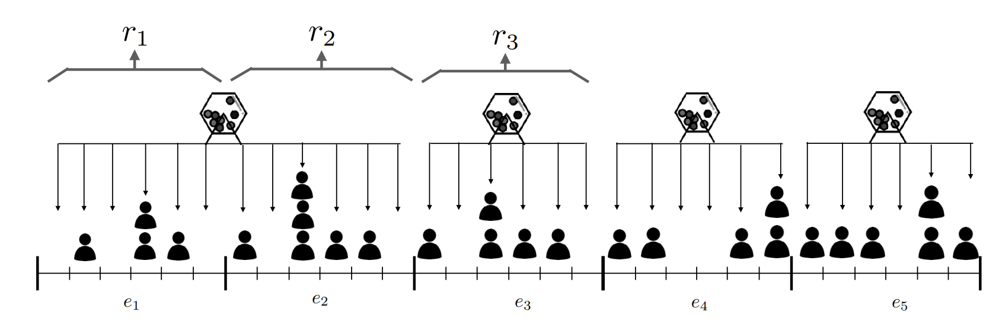

# 波卡中的随机性

> 原文链接：<https://wiki.polkadot.network/docs/learn-randomness>
>
> 翻译：[Akagi201](https://github.com/Akagi201)

权益证明区块链中的随机性对于公平和不可预测的验证人责任的分配很重要。计算机不擅长随机数，因为它们是确定性的设备（相同的输入总是产生相同的输出）。人们通常在计算机上所说的随机数（比如在游戏应用中），是伪随机的 -- 也就是说，它们依赖于用户或另一种类型的预言机提供的足够随机的种子，比如[大气噪声的气象站](https://www.random.org/randomness/)、你的[心率](https://mdpi.altmetric.com/details/47574324)，甚至[熔岩灯](https://en.wikipedia.org/wiki/Lavarand)，从中可以产生一系列看似随机的数字。但是，相同的种子，总是会产生相同的序列。

虽然，这些输入会根据时间和空间的不同而不同，而且不可能在世界各地的某一区块链的所有节点中得到相同的结果。如果节点得到不同的输入来构建区块，就会发生分叉。现实世界的熵并不适合作为区块链随机性的种子。

目前在生产中，有两种主要的区块链随机性方法。`RANDAO` 和 `VRF`。

波卡使用 VRF.

## VRF

可验证的随机函数（VRF）是一种数学运算，它接受一些输入并产生一个随机数，同时产生一个真实性证明，证明这个随机数是由提交者产生的。该证明可以由任何挑战者验证，以确保随机数的生成是有效的。

Polkadot 中使用的 VRF 与 Ouroboros Praos 中使用的大致相同。Ouroboros 的随机性对区块生产来说是安全的，对 [BABE](https://wiki.polkadot.network/docs/learn-consensus#BABE) 来说也很好用。它们的不同之处在于，Polkadot 的 VRF 不依赖于中央时钟（问题变成了 -- 谁的中央时钟？），相反，它依赖于自己过去的结果来确定现在和未来的结果，它使用槽数作为时钟模拟器，估计时间。

### 以下是他如何工作的细节

槽是不连续的时间单位，长度为 6 秒。每个槽可以包含一个区块，但也可以不包含。槽构成 [epochs](https://wiki.polkadot.network/docs/glossary##epoch) -- 在 Polkadot，2400 个槽构成一个 epoch，这使得 epoch 的长度为 4 小时。

在每个槽中，每个验证者 "掷骰子"。他们执行一个函数（VRF），将以下内容作为输入：

* "密钥", 一个专门为这些掷骰子而设的密钥。
* 一个 epoch 随机数，这是来自上一个 epoch（N-2）的区块的 VRF 值的散列，所以过去的随机性会影响当前的待定随机性（N）。
* 槽的编号。

输出是两个值：一个 `RESULT`（随机值）和一个 `PROOF`（证明随机值是正确生成的证明）。

然后将 `RESULT` 与协议执行中定义的阈值（特别是在 Polkadot 主机中）进行比较。如果该值小于阈值，那么掷出这个数字的验证者就是该槽位可行的区块生产候选人。然后验证者尝试创建一个区块，并将这个区块与之前获得的 `PROOF` 和 `RESULT` 一起提交给网络。在 VRF 下，每个验证者都为自己掷出一个数字，将其与一个阈值进行核对，如果随机掷出的数字低于该阈值，则产生一个区块。

精明的读者会注意到，由于这种工作方式，有些槽可能没有验证者作为区块生产者候选人，因为所有验证者候选人都掷得太高，错过了阈值。我们澄清了如何解决这个问题，并确保 Polkadot 的区块时间在[维基页面的共识](https://wiki.polkadot.network/docs/learn-consensus)中保持在恒定时间附近。

## RANDAO

在链上获得随机性的另一种方法是以太坊的 [RANDAO](https://github.com/randao/randao) 方法。RANDAO 要求每个验证者通过对一些种子进行成千上万次的哈希来进行准备。然后验证者在一个回合中公布最终的哈希值，随机数由每个参与者进入游戏的情况得出。只要有一个诚实的验证者参与，随机性就被认为是安全的（在经济上不可能被攻击）。

RANDAO 可以选择用 VDF 进行增强。

### VDF

[可验证的延迟函数](https://vdfresearch.org/)是指需要规定时间来完成的计算，即使在并行计算机上也是如此。它们产生独特的输出，可以在公共环境中独立和有效地进行验证。通过将 RANDAO 的结果输入 VDF，引入了一个延迟，使任何攻击者试图影响当前的随机性的行为变得过时。

VDF 可能会通过 ASIC 设备实现，需要与其他类型的节点分开运行。虽然只有一个就足以保证系统的安全，而且它们将是开源的，几乎是免费分发的，但运行它们既不便宜也没有激励，对选择这种方法的区块链用户产生不必要的摩擦。

## 资源

* [Polkadot 关于区块链随机性和分类的研究](https://w3f-research.readthedocs.io/en/latest/polkadot/block-production/Babe.html) -- 包含对所做选择的推理和证明。
* [关于 Polkadot 中使用的随机性的讨论](https://github.com/paritytech/ink/issues/57) - W3F 的研究人员讨论了 Polkadot 中的随机性，以及它何时可用，在何种假设下可用。
