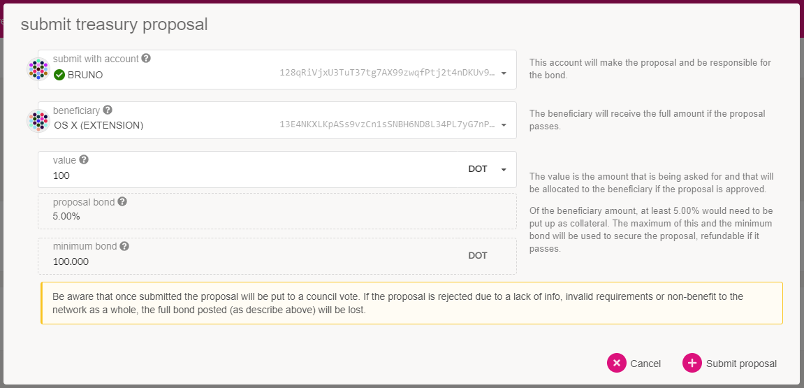
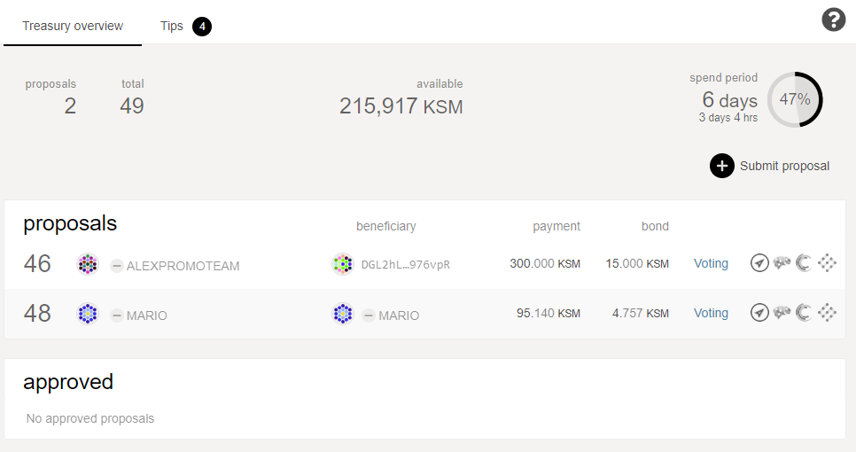
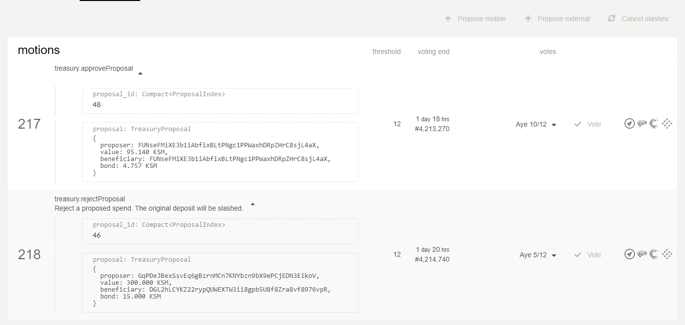
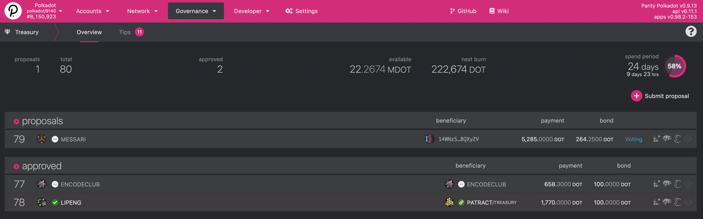

# Polkadot 国库

> 原文链接：<https://wiki.polkadot.network/docs/learn-treasury>
>
> 翻译：[Akagi201](https://github.com/Akagi201)

金库是通过部分区块生成奖励、交易费、惩罚、[质押收益](https://wiki.polkadot.network/docs/learn-staking#inflation)等方式收集的资金池。

国库中的资金可以通过提出支出提案来使用，如果得到[议会](https://wiki.polkadot.network/docs/learn-governance#council)的批准，在分配之前将进入一个等待期。这个等待期被称为花费期，其持续时间取决于[治理](https://wiki.polkadot.network/docs/learn-governance)，目前默认为 24 天。国库试图在不耗尽资金的情况下，尽可能多地花费队列中的提案。

国库支付是一个自动过程。

* 如果国库的资金用完了，但仍有已批准的提案需要资助，这些提案就会被保留在已批准的队列中，并在下一个支出期获得资助。
如果国库在一个支出期结束时没有花费所有的资金，它就会遭受一定比例的资金烧毁 -- 从而造成通货紧缩的压力。这鼓励了 Polkadot 的治理系统花费国库中的资金。这个百分比目前在 Polkadot 上是 1%。
* 当利益相关者希望从国库中提出支出时，他们必须保留至少 5% 的拟议支出的押金（见下文的变化）。如果提案被拒绝，该保证金将被削减，如果被接受，则将被退回。

提案可能包括（但不限于）:

* 基础设施部署和持续运行。
* 网络安全运营（监测服务，持续审计）。
* 生态系统供应（与友好的链合作）。
* 营销活动（广告、付费功能、合作）。
* 社区活动和推广（聚会、比萨饼派对、黑客空间）。
* 软件开发（钱包和钱包集成，客户端和客户端升级）。

[议会](https://wiki.polkadot.network/docs/learn-governance#council)管理国库，资金如何使用取决于他们的判断。

> ## 注意
>
> 议会并不根据可用的资金来批准或拒绝国库的提案。提案不会因为有准备好的资金可以使用而被批准，而是要经过烧毁。

## 资助国库

国库的资金来自不同的渠道。

1. 削减 (Slashing)：当验证人因任何原因被削减时，被削减的金额会被送到国库，并将奖励给举报验证人的实体（另一个验证人）。奖励从削减的金额中提取，并根据罪行和举报者的数量而有所不同。
2. 交易费：每个区块的交易费的一部分归国库，其余部分归区块作者。
3. 抵押品效率低下。通货膨胀在第一年被设计为 10%，理想的质押比例被设定为 50%，意味着所有代币的一半应该被锁定在质押中。任何偏离这一比例的行为都将导致按比例的通货膨胀归入国库。换句话说，如果所有代币的 50% 被押注，那么 100% 的通货膨胀就会作为奖励给验证者。如果押注率大于或小于 50%，那么验证者将获得较少的奖励，剩余的部分将归入国库。
4. Parathreads: Parathreads 参与每个区块的拍卖，以获得区块包含。该竞价的一部分归接受区块的验证者所有，其余的归国库。

## 创建一个国库提案

作为一项反垃圾信息的措施，提案人必须存入至少 100.000 DOT 或所要求金额的 5%，最高上限为 500.000 DOT。如果提案被拒绝，这一数额将被烧毁，否则将被退还。这些价值是受[治理](https://wiki.polkadot.network/docs/learn-governance)的，所以它们在未来可能会改变。

请注意，用户在提交国库提案后没有办法撤销它。议会将接受或拒绝该提案，如果提案被拒绝，bonded 资金将被烧毁。

### 宣布提案

为了尽量减少链上的存储，提案不包含上下文信息。当用户提交提案时，他们很可能需要找到一种链外的方式来解释该提案。大多数讨论是在以下平台进行的。

* 许多社区成员在 [Kusama Element (previously Riot)](https://matrix.to/#/#kusama:matrix.parity.io) 聊天室或 [Polkadot Element](https://matrix.to/#/#polkadot-watercooler:web3.foundation)中参与讨论。
* [Polkassembly](https://polkassembly.io/) 讨论平台，允许用户用他们的 Web3 地址登录，并自动读取链上的提案，把它们变成讨论帖子。它还提供了一个情绪测评投票，以便在承诺投票前了解提案的情况。

传播提案的解释最终取决于提案人 -- 推荐的方式是使用官方的 Element 渠道，如 [Polkadot Watercooler](https://matrix.to/#/#polkadot-watercooler:web3.foundation) 和 [Polkadot Direction room](https://matrix.to/#/#polkadot-direction:matrix.parity.io)。

### 创建提案

创建提案的一种方法是使用 [Polkadot-JS 应用程序网站](https://polkadot.js.org/apps/)。在网站上，使用 [extrinsics 选项卡](https://polkadot.js.org/apps/#/extrinsics)，选择 Treasury pallet，然后 `proposeSpend`，并输入所需的金额和收件人，或者使用[Treasury 选项卡](https://polkadot.js.org/apps/#/treasury)及其专用的提交提案按钮。

系统将自动提取所需的存款，在上述两个数值中选取较高的一个。

一旦创建，你的提案将在国库屏幕上可见，议会可以开始对其进行投票。

请记住，该提案没有元数据，所以要由提案人创建一个描述和目的，以便议会可以研究并基于其投票。

在这一点上，议会成员可以创建一个接受或拒绝国库提案的 motion。有可能一个接受的 motion 和另一个拒绝的 motion 同时产生。接受和拒绝议会提案的比例在接受或拒绝之间是不同的，可能取决于国库实施的是哪一个网络。

接受国库提案的门槛是至少五分之三的议会成员。另一方面，拒绝一项提案的门槛是至少二分之一的议会成员。

你会注意到国库 UI 顶部的 "支出期 (spend period)"。

## 小费

除了提案程序，国库还有一个单独的小费系统。任何人都可以提出小费，并得到议会成员的支持。小费没有任何明确的价值；小费的最终价值是根据小费者发出的所有小费的中位数决定的。

目前，给小费者与议会成员是一样的。然而，作为小费者不是议会的直接责任，在某些时候，议会和小费者可能是不同的账户组。

当超过半数加一的小费群体认可小费时，小费将进入关闭阶段。在这一时间段内，小费组的其他成员仍然可以发出他们的小费，但不一定要这样做。一旦窗口关闭，任何人都可以调用 `close_tip` 外部交易，小费就会被支付出去。

有两种类型的小费：公共小费和小费者发起的小费。对于公开的小费，需要一个小的保证金来放置它们。这个保证金取决于提示信息的长度，以及定义在链上的一个固定的保证金常数，目前是 1。公开提示带有 20% 的发现者费用，从总金额中支付。小费者发起的小费，即议会成员发布的小费，没有发现者费用或保证金。

为了更好地理解小费的支付过程，让我们考虑一个例子。

### 例子

Bob 为 Polkadot 做了一件大事。Alice 注意到了这一点，决定报告 Bob，认为他应该得到国库的小费。议会由三名成员 Charlie, Dave，和 Eve 组成。

Alice 通过发布 `report_awesome` 外部交易开始了这个过程。这个外部交易需要两个参数，一个是原因，另一个是要接收小费的地址。Alice 提交了 Bob 的地址，理由是一个 UTF-8 编码的 URL，用来解释她为什么 Bob 应该得到小费的理由。

如上所述，Alice 还必须为做这个报告锁定一个存款。押金是在链的参数列表中设置的基本押金，加上理由中包含的每一字节的额外押金。这就是为什么 Alice 提交了一个 URL 作为理由，而不是直接提交解释：对她来说，这样做更便宜。

对于她的麻烦，如果小费被小费者认可，Alice 就能要求最终的发现者费用。

由于给小费者团体与议会相同，议会现在必须集体（但也是独立）决定 Bob 应得的小费价值。

Charlie, Dave 和 Eve 都会审阅报告，并根据他们对 Bob 为 Kusama 提供的利益的个人评价来做小费。

比如说：

Charlie 给 10 DOT。Dave 给 30 DOT。Eve 给 100 DOT。

这笔小费可以在三个小费者中只有两个人的情况下结束。一旦超过一半的小费者组发出小费估价，关闭小费的倒计时就会开始。在这种情况下，第三位小费者在结账期结束前发布了他们的小费，所以这三个人都能够公布他们的小费估价。

现在，将支付给 Bob 的实际小费是这些小费的中位数，所以 Bob 将从财政部获得 30 DOT。

为了让 Bob 得到他的小费，某个账户必须在小费的结算期结束时调用 `close_tip` 外部交易。这个外部交易可以由任何人调用。

## 赏金 (Bounties) 花费

当涉及到国库提案时，议会成员的策划能力有实际限制。议会成员可能不具备对所有提案中描述的活动进行适当评估的专业知识。即使个别议员有这种专长，大多数议员也不可能有能力处理这种不同的主题。

赏金支出提案的目的是将支出提案的策展 (curation) 活动委托给称为策展人 (Curators) 的专家。他们可以被定义为对国库的一部分具有代理权的地址，目标是修复一个错误或漏洞，开发一个战略，或监测与特定主题相关的一组任务：所有这些都是为了 Polkadot 生态系统的利益。

提议者可以提交一个赏金提案供议会通过，策展人将在稍后确定，其背景和专长是有能力确定任务完成的时间。策展人是在悬赏提案通过后由议会挑选的，需要增加一笔预付款来担任这个职位。如果他们有恶意的行为，这笔押金可以用来惩罚他们。但是，如果他们成功地完成了让人完成赏金工作的任务，他们将收到押金和部分赏金的回报。

在提交赏金的价值时，提议者包括对愿意在任务中投入时间和专业知识的策展人的奖励：这一数额包括在赏金的总价值中。在这个意义上，策展人的费用可以定义为从悬赏的总价值中减去支付给悬赏对象的价值的结果。

一般来说，策展人应具有与赏金试图解决的问题有关的均衡的记录：他们至少应该对赏金涉及的主题有一定的了解，并显示出项目管理技能或经验。这些建议确保了该机制的有效使用。赏金支出是对指定的工作体 -- 或指定的目标集 -- 的奖励，需要执行预定的库房金额才能支付。一旦完成指定的一组目标，分配支付地址的责任就交给了策展人。

在议会激活赏金后，它将需要专业知识的工作委托给策展人，策展人可以关闭活动赏金。关闭活跃的赏金会向支付地址延迟支付，并支付策展人的费用。延迟阶段允许议会在出现任何问题时采取行动。

为了以与任何提案相同的方式尽量减少链上的存储，赏金不包含上下文信息。当用户提交赏金支出提案时，他们可能需要找到一个链外的方式来解释该提案（任何可用的社区论坛都可以达到这个目的）。[这个模板](https://docs.google.com/document/d/1-IBz_owspV5OcvezWXpksWDQReWowschD0TFuaVKKcU/edit?usp=sharing)可以帮助作为议会做出明智决定所需的所有信息的检查清单。

赏金的预定期限为 90 天，策展人有可能会延长。为了保持任务策划的灵活性，策展人将能够创建子悬赏，以便在该机制的下一次迭代中获得更多的细化和分配。

### 创建一个赏金提案

任何人都可以使用 Polkadot-JS Apps 创建一个赏金提案。用户能够在治理下的专用赏金部分提交提案。在 Polkadot Apps 中查看和管理赏金的强大用户界面仍在开发中，它将为议会成员、赏金的策展人和受益人，以及所有观察链上财政管理的用户提供服务。目前，需要议员的帮助才能将赏金提案作为一项 motion 进行投票。

要提交赏金，请访问 [Polkadot-JS Apps](https://polkadot.js.org/apps/#/)，点击网站顶部选项栏中的 governance 标签。之后，点击 "Bounties"，在界面的右上方找到 "+ Add Bounty"按钮。完成赏金标题、要求的分配（包括策展人费用）并确认调用。

在此之后，议会成员需要协助您将赏金提案作为议案通过表决。你可以通过加入 Element 中的 [Polkadot Direction 频道](https://matrix.to/#/#polkadot-direction:matrix.parity.io)或加入我们的 [Polkadot Discord](https://parity.link/polkadot-discord) 服务器来联系议会，并发布你的赏金的简短描述，并提供一个[论坛](https://wiki.polkadot.network/docs/learn-treasury#announcing-the-proposal)的链接以了解背景信息。

赏金可以通过删除特定国库金额的专款来取消，或者在任务已经完成的情况下被关闭。相反，赏金的 90 天有效期可以通过修改赏金的到期区块号码来延长，以保持活跃。

### 关闭一个赏金提案

一旦策展人批准完成赏金任务，就可以关闭赏金提案。策展人应确保事先在活动赏金上设置好支付地址。关闭活动赏金会颁布延迟支付给支付地址，并支付策展人费用。

关闭赏金的方法是：使用 extrinsics 标签，选择 treasury pallet，然后选择 `Award_bounty`，确保要关闭的赏金是正确的，最后签署交易。需要注意的是，那些在悬赏完成后获得奖励的人，必须在策展人关闭分配后，通过调用 `Claim_bounty`，从支付地址索取具体的支付金额。

要了解更多关于赏金和这个新机制如何运作，请阅读这篇 [Polkadot 博客文章](https://polkadot.network/blog/kusama-and-polkadot-now-reward-curators-helping-to-scale-councils-functions-join-the-force-moving-the-community-forward/)。

## FAQ

### 是什么阻止了国库被议会的大多数成员所俘获？

议会的多数成员可以决定国库支出提案的结果。在对抗的心态下，我们可以考虑这样一种可能性，即议会可能在某个时候耍流氓，试图窃取所有的国库资金。这是一种可能性，国库资金变得如此之大，以至于出现了一个巨大的财务激励。

首先，国库有通货紧缩的压力，因为每一个支出期都会遭受燃烧。燃烧的目的是激励在每个燃烧期完全花光所有国库资金，所以理想情况下，国库池没有时间积累大量的财富。然而，有一种情况是，国库的燃烧可以少到无所谓 -- 就像目前 Kusama 的 0.2% 燃烧一样。

然而，在 Kusama 的情况是，议会主要由社区的知名成员组成。请记住，议会是由代币持有者投票选出的，所以他们必须做一些竞选活动或以其他方式被认可以获得选票。在被攻击的情况下，议会成员将失去他们的社会信誉。此外，议会成员通常是以链的正常运行为外部动机。这种外部动机要么是因为他们经营着依赖该链的企业，要么是他们在代币价值保持稳定的情况下有直接的经济收益（通过他们的持股）。

具体来说，有几种链上方法可以抵制这种攻击。首先，议会的多数可能不是链上的代币多数。这意味着，如果议会试图进行这种攻击，代币多数可以投票取代议会 -- 甚至扭转国库支出。他们会通过正常的公投来做到这一点。第二，国库支出有时间上的延迟。它们只在每个支出期颁布。这意味着，将有一些时间来观察这种攻击的发生。然后，时间延迟使产业链参与者有时间做出反应。响应的形式可能是治理措施或 -- 在最极端的情况下，清算他们的持有量并迁移到少数分叉。然而，这种情况发生的可能性是相当低的。

## 进一步阅读

* [Substrate's Treasury Pallet](https://github.com/paritytech/substrate/tree/master/frame/treasury) - 国库的 Rust 实现 ([Docs](https://docs.substrate.io/rustdocs/latest/pallet_treasury/index.html))
