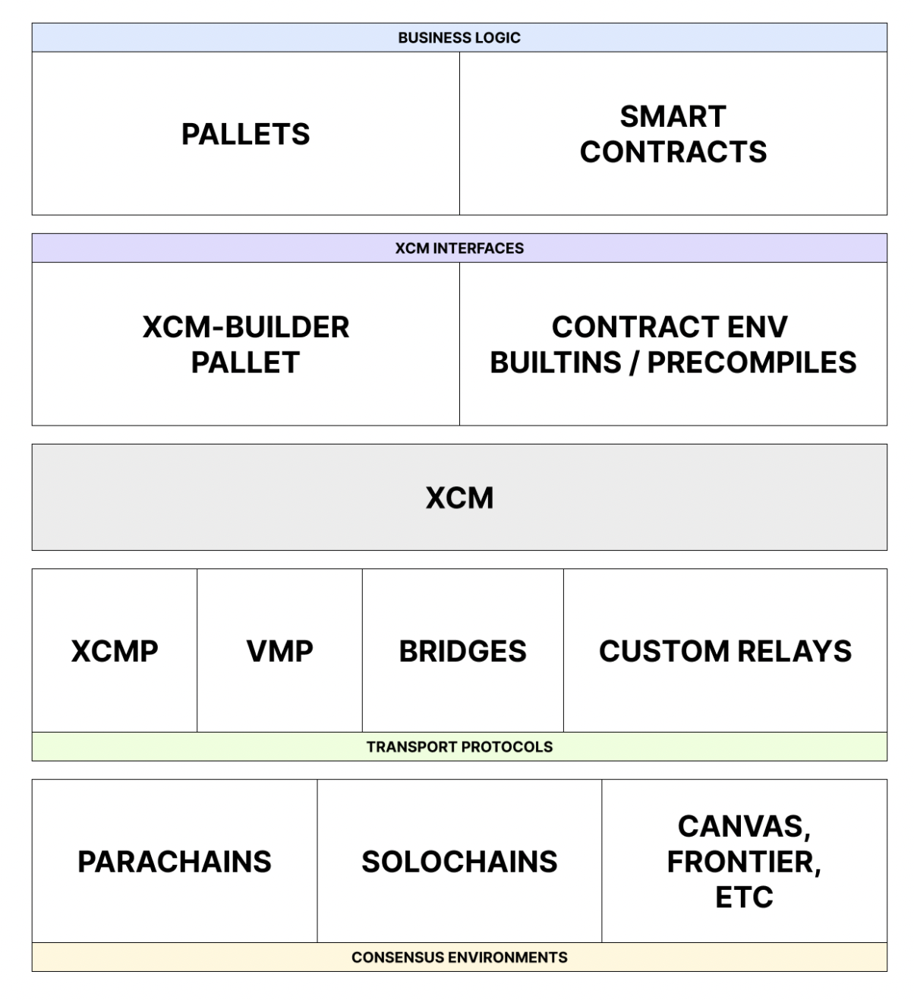

# 跨共识消息格式 (XCM)

> 原文链接：<https://wiki.polkadot.network/zh-CN/docs/learn-crosschain>
>
> 翻译：[Akagi201](https://github.com/Akagi201)

起初是一种跨链通信的方法，现在已经发展成为一种跨共识通信的格式，不仅在链之间进行，而且在智能合约、pallet、bridge、甚至像[SPREE](https://wiki.polkadot.network/zh-CN/docs/learn-spree)这样的分片聚集地之间进行。

## XCM 概述：一种格式，而不是一种协议

XCM 与跨链的关系就像 REST 与 RESTful 的关系一样。XCM 实际上不能在系统之间发送消息。它是一种应该如何进行消息传输的格式，类似于 RESTful 服务将 REST 作为一种部署的架构风格。
XCM 的目标是成为一种在共识系统之间交流思想的语言，因此，”跨共识 "具有以下特性：

* 具有通用性和可扩展性，可用于免 gas 费和需要 gas 费的智能合约平台，社区平行链、系统平行链及其中继链之间的可信互动等。
* 与交易格式未知的系统进行互动。
  > XCM 是良好版本的，抽象和通用的，可以作为提供一个持久的交易格式的手段，供钱包用来创建许多常见的交易。它是可扩展的，反过来也是面向未来和向前兼容的。
* 在一个严格限制和计量的环境中运行效率很高，就像许多链一样。

> ### 注意
>
> XCM 的设计并不是让每个支持该格式的系统都能解释任何可能的 XCM 消息。实际上，我们可以想象，有些消息在某些系统下没有合理的解释，或者故意不被支持。

## 案例

* 请求在接收方系统上进行特定的操作。
* 可选择地包括在目标网络上为请求的操作支付费用。
* 为各种代币转移模型提供方法：
  > * Remote Transfers: 远程转移，控制远程链上的一个账户，允许本地链在远程链上有一个地址用于接收资金，并最终将其控制的这些资金转移到该远程链上的其他账户。
  > * Teleporting: 远程传输，资产的移动是通过在一侧摧毁它并在另一侧创建一个克隆来实现的。
  > * Reverse-Based Transfer: 基于反向的转移，可能有两条链想提名第三条链，其中一条链包括一个原生资产，可以作为该资产的储备。然后，这些链中的每一条上的资产的衍生形式将被完全支持，允许衍生资产与支持它的储备链上的基础资产进行交换。

## XCM 技术栈

XCM 可用于表达这三种通信通道上的信息的含义。

## 跨共识协议

随着 XCM 格式的建立，需要对这些信息进行协议的通用模式。Polkadot 实现了两个用于在其组成的平行链之间对 XCM 消息采取行动的模式。

### VMP (Vertical Message Passing，垂直消息传递)

有两种垂直消息传递传输协议：

* UMP(Upward Message Passing，向上消息传递): 允许平行链向他们的中继链发送消息。
* DMP(Downward Message Passing，向下消息传递): 允许中继链向他们的平行链之一发送消息。

通过 DMP 传递的消息可能来自于一条平行链。在这种情况下，首先用 UMP 将消息传达给中继链，然后用 DMP 将其下移到另一个平行链。

### XCMP(Cross-Chain Message Passing，跨链消息传递)

XCMP 允许平行链与同一中继链上的其他平行链交换信息。

跨链交易使用基于 Merkle 树的简单排队机制来解决，以确保真实性。中继链验证者的任务是将一个平行链的输出队列中的事务转移到目标平行链的输入队列中。然而，只有相关的元数据以哈希值的形式存储在中继链存储中。

输入和输出队列有时在 Polkadot 代码库和相关文档中分别被称为入口 (ingress) 和出口 (egress) 信息。

### XCMP-Lite (HRMP)

虽然 XCMP 仍在实施中，但有一个称为 Horizontal Relay-routed Message Passing（HRMP，水平中继路由消息传递）的临时协议（见下面的定义）代替它。HRMP 具有与 XCMP 相同的接口和功能，但对资源的要求要高得多，因为它把所有的消息都存储在中继链存储中。当 XCMP 实现后，HRMP 计划被废弃，并逐步被淘汰，以取代它。

> ### 注意
>
> 临时协议是对未完全完成的功能的临时替代。虽然 XCMP 本身仍在开发中，但 HRMP 是一种可工作的替代。

### XCMP 设计

> xcmp 目前正在开发中，细节可能会有变化。

然而，这种整体架构和设计决定是比较稳定的：

* 跨链信息将不会被传递到中继链上。
* 跨链消息将被限制在一个最大的字节大小上。
* 平行链允许阻断来自其他平行链的消息，在这种情况下，调度平行链的人将会知道这个阻断。
* 收集人节点负责链之间的消息路由。
* 收集人产生一个出口 (egress) 消息的列表，并将接收来自其他平行链的入口 (ingress) 消息。
* 在每个区块上，预计平行链会从所有其他平行链的一些子集中路由消息。
* 当收集人产生一个新的区块交给验证人时，它将收集最新的进站 (ingress) 队列信息并进行处理。
* 验证人将检查下一个平行链区块的新候选者的证明，包括对该平行链的预期进站 (ingress) 消息的处理。

XCMP 队列的启动必须首先在两个平行链之间打开一个通道。该通道由发送方和接收方的平行链识别，这意味着它是一个单向的通道。一对平行链之间最多可以有两个通道，一个用于向另一个链发送消息，另一个用于接收消息。该通道需要用 DOT 交纳押金才能打开，当通道关闭时，押金会被退回。

### XCMP 消息格式

关于 XCMP 消息格式的更新和完整描述，请参见 GitHub 上的 [xcm-format](https://github.com/paritytech/xcm-format) 仓库。

### XCMP 交互剖析

存在于 parachain A 上的一个智能合约将把一个消息路由到 parachain B，其中调用了另一个智能合约，在该链内进行一些资产的转移。

查理在 parachain A 执行智能合约，它为 parachain B 的智能合约的目的地发起一个新的跨链消息。

parachain A 的收集人节点将把这个新的跨链消息连同目的地和时间戳一起放入其出站消息队列。

Parachain B 的收集人节点会定期 ping 所有其他收集人节点，询问新的消息（通过目的地字段进行过滤）。当 parachain B 的收集人进行下一次 ping 时，它将看到 parachain A 的这个新消息，并将其添加到自己的入站队列中，以便处理到下一个区块。

parachain A 的验证人也会读取出站队列并知道该消息。Parachain B 的验证人也将做同样的事情。这是为了让他们能够验证信息传输的发生。

当 parachain B 的验证人在其链中建立下一个区块时，它将处理其入站队列中的新消息，以及它可能发现/收到的任何其他消息。

在处理过程中，该消息将执行 parachain B 的智能合约，并按计划完成资产转移。

收集人现在把这个区块交给验证人，验证人本身将验证这个消息是否被处理。如果消息被处理了，并且区块的所有其他方面都是有效的，验证器将把 parachain B 区块纳入中继链。

请看我们下面的动画视频，它探讨了 XCMP 的工作原理。
