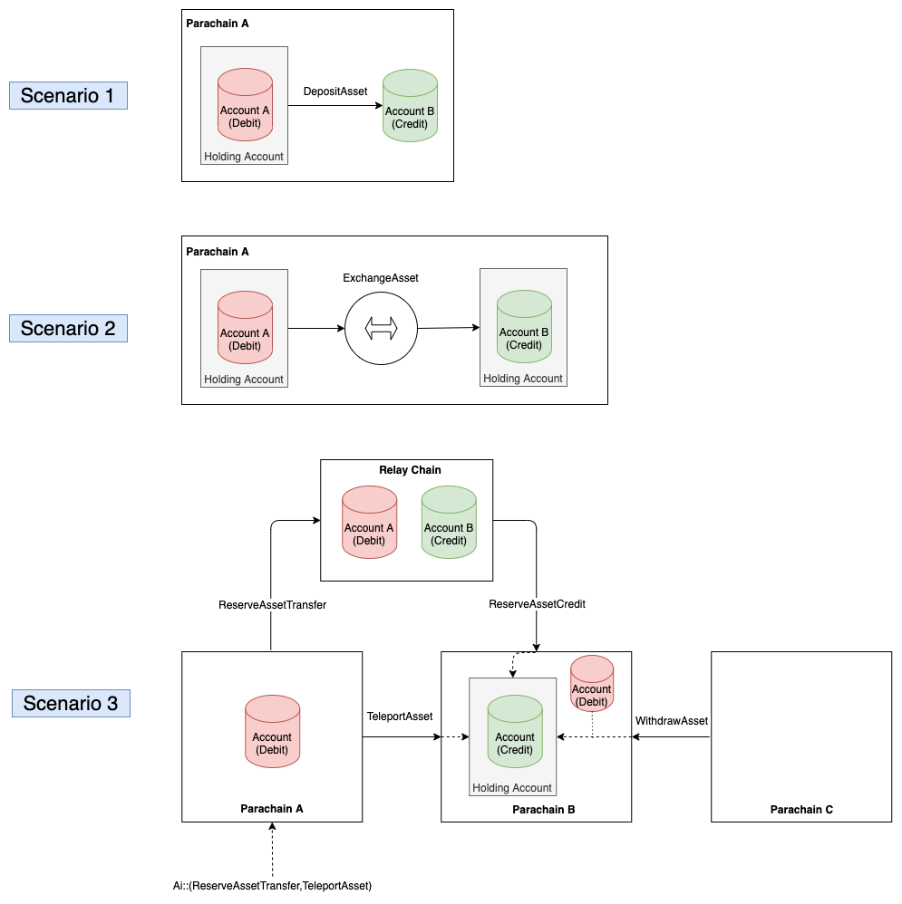

# 波卡跨共识消息 (XCM) 格式

> 原文链接：<https://github.com/paritytech/xcm-format/blob/master/README.md>
>
> 翻译：[Akagi201](https://github.com/Akagi201)

**版本 3，进行中。**
**作者: Gavin Wood.**

本文件详细介绍了基于 Polkadot 的链间消息传递的消息格式。它描述了正式的数据格式，任何可能额外需要的环境数据以及数据报的相应含义。

## 1 背景

有几种*共识系统*，为其提供通信便利是有利的。这包括智能合约和其环境之间的信息，主权区块链之间通过桥的信息，以及受同一共识支配的分片之间的信息。不幸的是，每个人都有自己的信息传递方式和标准，或者根本没有标准。

XCM 旨在抽象出这些系统之间的典型消息意图，并为向前兼容、可扩展和实用的通信数据报提供一个基本框架，促进全球共识世界内不同数据系统之间的典型交互。

来自 IPFS 项目的概念，特别是自我描述格式的想法，贯穿始终，并引入了两种新的自我描述格式，用于指定资产（基于 `MultiAsset`）和共识系统位置（基于 `MultiLocation`）。

Polkadot 有三个主要的传输系统，用于在链之间传递消息，所有这些都将使用这种格式。XCMP（有时被称为 HRMP）以及两种 VMP：UMP 和 DMP。

- **XCMP** *Cross-Chain Message Passing* 平行链之间的安全消息传递。有两个变种。*Direct*和*Relay*。
  - 在*Direct*模式下，消息数据在平行链之间直接传递，在中继链方面是 O(1)，并且是非常可扩展的。
  - 在*Relayed*模式下，消息数据通过中继链传递，并在 VMP 上捎带着进行。它的可扩展性要差得多，特别是平行线程 (parathreads) 可能会因为队列的过度增长而无法收到消息。
- **VMP* *Vertical Message Passing* 在中继链本身和平行链之间传递消息。两种情况下的消息数据都存在于 Relay-chain 上。这包括。
  - **UMP** *Upward Message Passing* 从一个平行链到中继链的消息传递。
  - **DMP** *Downward Message Passing* 从中继链到平行链的消息传递。

### 1.1 XCM 通信模型

XCM 是围绕 4 个 'A' 来设计的：

- *异步的 (Asynchronous)*: XCM 消息决不是假定发件人在完成时是阻塞的。
- *绝对的 (Absolute)*: XCM 消息保证准确、有序、及时地被传递和解释。
- *非对称性 (Asymmetric)*: XCM 消息没有结果。任何结果都必须用额外的消息单独告知发送者。
- *不可知论 (Agnostic)*: XCM 对传递信息的共识系统的性质不做任何假设。

XCM 提供了这些*绝对*的保证，这使得它实际上是*非对称*的，而其他非绝对协议会发现这很困难。

作为*不可知论*，XCM 不仅仅适用于平行链和/或中继链之间的消息，而且是适用于通过一个或多个桥连接的不同链之间的信息，甚至适用于智能合约之间的消息。使用 XCM，上述所有各方都可以相互通信，或通过对方通信。

例如，完全可以想象，使用 XCM，托管在 Polkadot 平行链上的智能合约可以通过 Polkadot 将其拥有的不可伪造的资产转移到位于另一个平行链上的 Ethereum-mainnet 桥，通过 Polkadot-Kusama 桥在托管在 Kusama 平行链上的第三个专门的 Substrate NFA 链上登记所有权的转移，从而进入 Ethereum 主网上控制的账户。

### 1.2 XCVM

XCM 格式在很大程度上借鉴了一个高度特定领域的虚拟机，称为 *跨共识虚拟机* 或 *XCVM* 。XCM 消息直接对应于具有版本意识的 XCVM 程序，而 XCVM 指令集代表了 XCM 消息可以组成的一系列动作。

XCVM 是一种基于寄存器的虚拟机，其寄存器都不是通用的。因此，XCVM 指令格式、机器寄存器集和交互定义是 XCM 报文格式的主要内容，本文档的大部分文字都是用来表达这些定义的。

### 1.3 词汇表

- *共识系统* 一个链、合约或其他全局的、封装的、状态机单例。它可以是存在于共识中的任何程序化的状态转换系统，可以发送/接收数据报。可以通过一个 `MultiLocation` 值来指定（尽管不是所有这样的值都能确定一个*共识系统*）。例子包括 *Polkadot Relay chain*, *XDAI Ethereum PoA chain*, *Ethereum Tether smart contract*.
- *位置* 一个*共识系统*，或一个存在于其中的可寻址账户或数据结构。例如，Polkadot Relay-chain 上的财政部账户，Edgeware parachain 上的主要 Web3 基金会账户，Edgeware parachain 本身，Web3 基金会的 Ethereum multisig 钱包账户。由`MultiLocation`指定。
- *主权账户 (Sovereign Account)* 一个由特定的*共识系统*控制的账户，在一些其他*共识系统*内。这样的账户可能有很多，也可能只有一个。如果有很多，那么这就假定并确定了一个独特的*主要*账户。
- *XCVM* 交叉共识的虚拟机，XCM 信息的定义很大程度上依赖于此。
- *Reserve Location* 在特定（衍生）*Consensus System*上作为特定资产的储备的*Consensus System*。储备*共识系统*总是被衍生品所知道。它将有一个衍生品的*主权账户*，其中包含衍生品资产的全部抵押品。
- *起源* 某一信息是由其（直接和立即）传递的*共识系统*。指定为 "多处"。
- *收件人* 某一信息被传递到的*共识系统*。指定为 `MultiLocation`。
- *远程传输 (Teleport)* 在一个地方销毁一个资产（或资金/代币/货币的数量），并在第二个地方铸造一个相应的数量。想象一下*星际迷航*中的传送器。这两个地方的性质不一定相等（例如，可以是一个销毁资产的 UTXO 链和一个铸造资产的基于账户的链）。任何一个地方都不能作为另一个地方的储备或衍生品。虽然代币的性质可能不同，但两个地方都不比另一个地方更权威。这只有在 STF 和它们之间的有效性/财务性/可用性都存在双边信任关系的情况下才有可能。
- *转移* 资金从一个控制机构转移到另一个控制机构。这是在同一链条或整体资产所有权环境中，在同一抽象层次上。

### 1.4 文档结构

该格式被定义为五个主要部分。顶层数据报格式在第 2 节中规定。XCVM 在第 3、4 和 5 节中定义。第 6 和第 7 节定义了 `MultiLocation` 和 `MultiAsset` 格式。第 8 节中规定了消息的例子。

### 1.5 编码

所有的数据都是 SCALE 编码的。基本类型用 Rust 语言格式表示，例如。

- 32 位有符号的整数被写成`s32`。
- 64 位无符号整数写成 `u64`。

当一个类型的无序列表 -- 可能是命名的 -- 被给出时，它意味着单个类型值的简单串联。例如，一个 64 位无符号的 "索引"，后面是一串字节的 "数据"，可以写成。

- `index: u64`
- `data: Vec<u8>`

## 2 基础顶级格式

